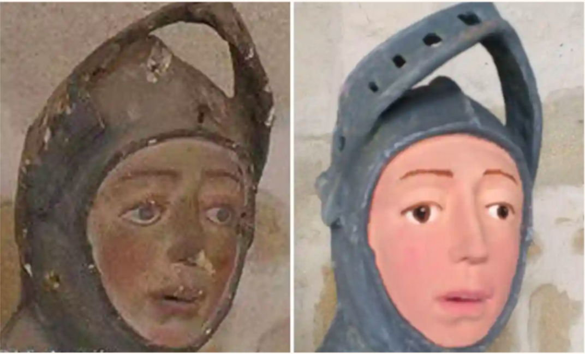
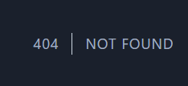
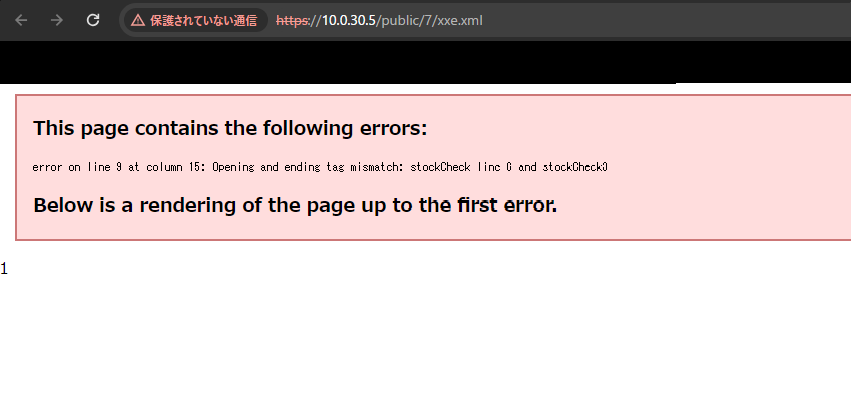

# NFLabs. Cybersecurity Challenge for Students 2023 Writeup

## 目次

- 概要・感想
- OSINT
  - [[Easy] ntt.com](#easy-nttcom)
  - [[Medium] Repair](#medium-repair)
  - [[Medium] stranger than fiction](medium-stranger-than-fiction)
  - [[Easy] celebration](easy-celebration)
- DFIR
  - [[Easy] flower](#easy-flower)
  - [[Easy] rockyou](#easy-rockyou)
  - [[Medium] invader (1)](#medium-invader-1)
  - [[Medium] invader (2)](#medium-invader-2)
  - [[Medium] invader (3)](#medium-invader-3)
- Web
  - [[Easy] ASCII](#easy-ascii)
  - [[Easy] UniDine](#easy-unidine)
- Dev
  - [[Easy] stegano](#easy-stegano)
- PenTest
  - [[Hard] 帰雲城 (1)](#hard-帰雲城-1)

## 概要・感想

[NFLabs. Cybersecurity Challenge for Students 2023](https://nflabs.jp/information/#ct5pv1tzq1gt)のWriteup。このWriteupは解法だけでなく解く過程での思考や試したことを含めて書いた。  

全体として問題のクオリティが高く面白かった。ありがとうございました。  
競技としてのCTFというよりリアルワールドでの実務に近い構成の問題が多かった。普段競技としてのCTFに参加している感覚としては、とっかかりを掴むのに時間と労力、推測を必要とする点がやや煩わしく感じたが、逆に自分の苦手部分でもあるので今後身に付けていきたいところ。  

## OSINT

### [Easy] ntt.com

> ntt.comのドメイン名を日本電信電話株式会社(関連企業を含む)が登録する以前に登録していた企業の名前を答えてください。

まず「whois history」などで検索していたらWHOIS Historyなるサービスがいくつか見つかったが、どれも有料のものが多く、無料のものを試しても回答を得ることはできなかった。  
Wayback Machineを使う方法を思い付き、試してみると最も古いページで1997年1月17日のものが見つかる。そのページを確認すると企業名らしき「National TechTeam, Inc.」が見つかる。  
1997年1月17日のntt.comのページ: https://web.archive.org/web/19970117135312/http://www.ntt.com/

### [Medium] stranger than fiction

> ある著名な元俳優が2022年2月下旬、国会議員のDavid braun氏を含む5名で撮った動画をSNSにアップロードしました。 その俳優の代表作の第一話冒頭に映っている記念碑の場所を答えてください。 回答は緯度経度を小数点下一桁(下二桁目以降は切り捨て)までお願いします。
> 
> [解答形式 : N**.*,E**.*]

まずDavid Braun氏について調べると、ウクライナの国会議員であることがわかる。ここで、私は"ある著名な元俳優"がゼレンスキー大統領であるとguessingして進めてしまったので、5名で撮ったSNSの動画は探していない。  
ゼレンスキー大統領の代表作『国民の僕』がYouTubeで無料公開されていたので冒頭部分を確認する。映っている記念碑をGoogle Lensで検索すると、キエフにある「Independence Monument」であるとわかる。Google Mapで探し、回答形式に合わせて`N50.4,E30.5`。

『国民の僕』: https://youtu.be/GZ-3YwVQV0M?si=0k5ITaBsRKb_OJFm

### [Medium] Repair

> この銅像の修復にかかった費用をユーロで答えてください。
>
> [解答形式 : €**.***]  
> 

Google Lensを使って画像検索をすると、スペインにある聖ジョージ像の修復失敗事件の比較画像であることがわかる。現地のサイトのほうが詳しいことが多いのでスペイン語でGoogle検索を行う。また、ユーロという指定があるため記事中に必ず"€"という文字を含むだろうという推測のもと、「Restauración de la estatua de San Jorge intext:€」などの検索クエリでいろいろと検索を行うと、[El San Jorge de Estella, restaurado tal como debió de ser en el siglo XVIII](https://www.abc.es/cultura/abci-san-jorge-estella-restaurado-como-debio-siglo-xviii-201906211059_noticia.html) という記事の中に「pero tras el desaguisado la cantidad se ha elevado hasta los 30.759,72 euros,(しかし混乱の後、金額は30,759.72ユーロまで上昇し、)」という記述が見つかる。
回答形式に合わせて`€30.759`。

### [Easy] celebration

> カタールW杯のベストゴールのゴールセレブレーションの輪の真後ろで、イギリスのあるプロサッカークラブの横断幕が掲げられていました。 そのクラブの名前にもなっている街の名前をアルファベットで答えてください。

カタール杯のブラジル対セルビア戦のいろいろな映像を探すと、ニコニコ動画に挙げられた動画の中でゴールセレモニー部分の映像がある。05:31あたりで背景の横断幕を探すと、かなりぼやけているがイングランド旗をベースにした二つの横断幕が見つかる。大きいほうの横断幕を見ると、白地の4つのスペースのうち、左上と右下に赤いロゴが、右上と左下にテキストが入ったものとなっている。  
「England Soccer club Banners」で検索し、イングランド旗の右下と左上に赤いロゴのあるものを探すと、以下の画像が見つかる。
  
ロゴの上部にMIDDLESBROUGHの文字があり、調べるとこれがクラブ名であることがわかる。

ニコニコ動画上にある動画: https://www.nicovideo.jp/watch/sm41418615
横断幕の画像のあったページ: https://www.footballfanflags.co.uk/products/football-flag-6ft-x-3ft-183cm-x-91cm-2


## DFIR

### [Easy] flower

> 会社で管理しているWebサイトにアクセスすると、「We hacked your Web page :)」という文章が表示されるというインシデントが発生しました。あなたはWebサーバを調査したが、不審なログを発見することはできませんでした。 しかし、調査の過程でWebサイトのドメイン名をDNS名前解決した際、本来のIPアドレスとは異なるIPアドレスが返っていることを発見しました。あなたはDNSに問題が発生していると考え、通信経路上で取得していたパケットデータを確認することにしました。 pcapngファイルを解析し、インシデントの原因となる攻撃を行ったと考えられる端末のIPアドレスを解答してください。
>
> flower.pcapng (添付ファイル)

まず問題文から恐らくDNSスプーフィングである。「We hacked your Web page :)」というレスポンスが返されているレコードを探すと、そのときのIPアドレスは`10.64.3.178`となっている。IPアドレスが変更される前でDNSアクセスをしているSouce IPアドレスを確認すると`10.64.3.101`。

### [Easy] rockyou

> あなたの運営しているwebアプリケーションにおいて、不正ログインが発生している可能性があるという報告がありました。それを知った同僚がパケットキャプチャを行ってくれていました。セキュリティ担当であるあなたは、手元にあるデータを用いて不正ログインに関する調査を行うこととなりました。Webサーバのアクセスログとpcapファイルを元に不正ログインされている可能性が高いと思われるユーザのユーザ名を解答してください。

パケットを見ると、辞書攻撃でWebの認証試行をしていることがわかる(また、問題名rockyouは有名な辞書攻撃用ワードリストの名前)。  
少し見た範囲ではすべて`401 Unauthorized  (text/html)`が返されているが、HTTPかつ送信先がWebサーバーのIPアドレスとなるフィルター(`http && ip.dst == 172.27.0.1`)を適用し、Infoタブでソートすると、1件だけOKが返されているレコード(No. 28527)がある。レスポンスの内容を確認すると、`Form item: "username" = "william"`とある。

### [Medium] invader (1)  

> 【導入】  
> Windowsのサーバーに対して外部から不正アクセスを検知したため、この端末のイベントログを抽出した。  
> このログを分析し、invader (1) ～ (3)までの3つの問に答えよ。3つの問の解答順序は問わないものとする。  
> 
> 【Q1】  
> 侵入元のIPアドレスを答えよ。  
> 注：192.168.0.0/24以外のIPアドレスはすべて外部のIPアドレスとする。  
> 回答方式：IPアドレスを答える  
> 回答例：192.0.2.2  
> 
> eventlogs.zip (添付ファイル)

eventlogs.zipを解凍するとたくさんのevtxファイルが出てくる。Windowsイベントビューアーで軽く確認する。
Security.evtxの中にリモートログイン試行のイベントが複数見つかる。送信元IPアドレスを見ると`192.168.81.128`。

> ### [Medium] invader (2)
> 
> invader (1) の続き
> 
> 【Q2】  
> 攻撃者は、侵入後にWindows Defenderの設定を変更し特定のフォルダーを検知の対象外とした。  
> そのフォルダーを答えよ。  
> 回答方式：フォルダーのフルパスを回答（case insensitive）  
> 回答例：C:\Windows\Tasks\  

まず「Windows Defenderの設定を変更し特定のフォルダーを検知の対象外とする」というアクションのイベントIDを調べる。  
[拡張機能、名前、または場所に基づいて除外を構成して検証する | Microsoft Learn](https://learn.microsoft.com/ja-jp/microsoft-365/security/defender-endpoint/configure-extension-file-exclusions-microsoft-defender-antivirus?view=o365-worldwide)を調べるが具体的なイベントIDがわからなかった。そのため、自分のPCで実際にWindows Defenderの設定を変更して特定のフォルダーを検知の対象外し、「Microsoft-Windows-Windows Defender%4Operational」を確認すると、「情報	2023/11/24 13:27:02	Windows Defender	5007	なし」とあり、イベントIDが`5007`であるとわかった。  
配布ファイルのほうで「Microsoft-Windows-Windows Defender%4Operational」のイベントIDが`5007`であるイベントログを確認すると`C:\`が丸ごと除外されていることがわかる。

### [Medium] invader (3)

> invader (2)の続き
>
> 【Q3】  
> 攻撃者は、永続化のためにとあるファイル（実行ファイルまたはスクリプトファイル）をOS起動時に自動的に実行するように設定した。  
> 攻撃者が用意したOS起動時に自動的に実行されるファイルを答えよ。  
> 回答方式：ファイルのフルパスを回答（case insensitive）  
> 回答例：C:\Windows\Tasks\test.exe  

この問題は競技期間中に正解できなかったが、後々メモを見返したら`C:\Users\Administrator\rtcp.exe`とするべきところを`C:\\Users\\Administrator\\rtcp.exe`とエスケープシーケンスのまま回答していた...(悲しい)。  
まず私自身がWindowsイベントビューアーの使い方に詳しくなく、テキストとして抽出してまとめて`grep`にかけたりしたくなったためツールを探してインストールする。[omerbenamram/evtx](https://github.com/omerbenamram/evtx)を用いた。
OS起動時に自動的にファイルを自動実行する永続化手法は複数あるので、[MITRE ATT&CK®](https://attack.mitre.org/)を見ながら怪しいものを確認する。具体的には以下のものに目を付けて調査した。  

- Boot or Logon Autostart Execution(T1547)
- Boot or Logon Initialization Scripts(T1037)
- Event Triggered Execution(T1546)
- Hijack Execution Flow(T1574)
- Office Application Startup(T1137)

レジストリキーの変更やスタートアップフォルダに関するもの、ログオンスクリプト、スケジュールタスク実行、PowerShellプロファイルやWMIイベントによるイベント起動などを確認したが決定的に不審なポイントのあるファイルは見つからなかった。  
イベントログダンプからファイルのパスを含む部分をgrepで抽出し、見つかったファイルパスから逆順に不審なものを探索する方針に切り替えた。`evtx_dump-v0.8.1.exe -o json Security.evtx | grep 'C:' | grep -v 'ProcessName' | sort | uniq`のようなコマンドで抽出し、Windowsの正規のファイルに対する正規のイベントであるかを調べながら確認すると、怪しいものとしてタスクスケジューラで`C:\Users\Administrator\rtcp.exe`を実行しているものが見つかる。

## Web

### [Easy] ASCII

入力欄に適当な文字を入れてみるとAAが出てくる。ページのソースを見るとフロントエンドでは特に生成していないためバックエンドで生成していることがわかる。  
このAAの出力は恐らく[figlet](https://ja.wikipedia.org/wiki/FIGlet)を叩いていそうなので、OSコマンドインジェクションとみて`;ls`などを入れてみるとlsコマンドの実行結果が出る。`;cat flag.txt`でフラグゲット。

### [Easy] UniDine

いろいろと見てみると適当なログイン試行でlogin.phpというページに飛ぶのが確認でき、PHP製であるとわかる。サーバーはApache/2.4.52 (Ubuntu)。ディレクトリリスティングがオンになっており、`/shoplist/cafe1/img/`の下にDSC_から始まる使われていない画像があったため勘ぐってしまったが何も関係なかった。  
ログイン画面でユーザID/パスワードに`'OR'1'='1'; --`を試すとMySQLのエラーが返ってくる。MySQLには別の記法もあるので`#`を使い後ろをコメントアウトするクエリ(`'OR'1'='1'; #`)を試すとフラグが手に入る。

### [Easy] stegano

> ステガノプログラムmain.goを用いてflagを画像の中に隠した。画像からflagを見つけよ。
> 
> sha256(stegano.zip): d8eca524dc8d92e00b91b89d26d17d896e97be6e2db6aa89e5690e7559d79596

配布ファイルの中には以下のGoスクリプトと1枚のPNGファイルがある。

```go
package main

import (
	"bufio"
	"image"
	"image/color"
	"image/png"
	"log"
	"os"
)

func main() {
	reader, err := os.Open("original.png")
	if err != nil {
		log.Fatal(err)
	}
	defer reader.Close()
	m, _, err := image.Decode(reader)
	if err != nil {
		log.Fatal(err)
	}
	bounds := m.Bounds()
	im := image.NewRGBA64(image.Rect(0, 0, bounds.Dx()*2, bounds.Dy()*2))
	for i := 0; i < bounds.Dx(); i++ {
		for j := 0; j < bounds.Dy(); j++ {
			c := m.At(i, j)
			im.Set(i*2, j*2, c)
			im.Set(i*2+1, j*2, c)
			im.Set(i*2, j*2+1, c)
			im.Set(i*2+1, j*2+1, c)
		}
	}
	file, err := os.Open("flag.txt")
	if err != nil {
		log.Fatal(err)
	}
	defer file.Close()
	s := bufio.NewScanner(file)
	s.Scan()
	flag := s.Text()
	x := 100
	y := 100
	for i := 0; i < len(flag); i++ {
		r1, g1, b1, a1 := im.At(x*2, y*2).RGBA()
		r2, g2, b2, a2 := im.At(x*2+1, y*2).RGBA()
		r3, g3, b3, a3 := im.At(x*2, y*2+1).RGBA()
		box := []uint8{uint8(r1), uint8(g1), uint8(b1), uint8(r2), uint8(g2), uint8(b2), uint8(r3), uint8(g3)}
		for j := 0; j < 8; j++ {
			if (flag[i] & byte(1<<j)) != 0 {
				if box[j] == 0 {
					box[j] = box[j] + 1
				} else {
					box[j] = box[j] - 1
				}
			}
		}
		im.Set(x*2, y*2, color.RGBA{R: box[0], G: box[1], B: box[2], A: uint8(a1)})
		im.Set(x*2+1, y*2, color.RGBA{R: box[3], G: box[4], B: box[5], A: uint8(a2)})
		im.Set(x*2, y*2+1, color.RGBA{R: box[6], G: box[7], B: uint8(b3), A: uint8(a3)})
		x = x + 1
		y = (y + int(uint8(b3))) % bounds.Dy()
	}

	result, err := os.Create("stegano.png")
	if err != nil {
		log.Fatal(err)
	}
	defer result.Close()
	if err := png.Encode(result, im); err != nil {
		log.Fatal(err)
	}
}

```

上記のGoスクリプトを読むと、画像の縦横サイズをそれぞれ2倍に拡大し、特定のアルゴリズムで導かれる座標列のRGBの値を1ずらすかずらさないかでビット列を埋め込む独自のStegano手法である。画像を2倍に拡大すると1つのピクセルは4つに複製されるが、必ず右下のピクセルのRGBは保存されるため、オリジナルのRGBの値がわかり、ずらされているかずらされていないかを求められる。  
Goの練習がてらそのままソルバスクリプトを書こうと思ったが結局慣れているPythonで以下のソルバを書いた。

```py
from PIL import Image


im = Image.open("./stegano.png")

x = 100
y = 100
n = 30
flag_bin = ""

for i in range(n):
    r1, g1, b1 = im.getpixel((x * 2, y * 2))
    r2, g2, b2 = im.getpixel((x * 2 + 1, y * 2))
    r3, g3, b3 = im.getpixel((x * 2, y * 2 + 1))
    r4, g4, b4 = im.getpixel((x * 2 + 1, y * 2 + 1))
    
    box = [r1, g1, b1, r2, g2, b2, r3, g3]
    original_box = [r4, g4, b4, r4, g4, b4, r4, g4]
    
    
    for j in range(len(box)):
        if abs(original_box[j] - box[j]) != 0:
            flag_bin += "1"
        elif original_box[j] == box[j]:
            flag_bin += "0"
        else:
            print("ERROR", box[j] - original_box[j], i, (x, y))

    x = x + 1
    y = (y + b3) % (im.size[1] // 2)

print(flag_bin)

flag = ""
for i in range(len(flag_bin) // 8):
    flag += chr(int(flag_bin[8 * i:8 * i + 8][::-1], 2))
print(flag)
```

## PenTest

### [Hard] 帰雲城 (1)

※解けませんでしたが途中まで進められたので試したことを書きます。時系列は適当です。  
  
CTFというよりHackTheBoxという感じだったので恐る恐るまずnmapでオープンポートを探すと、HTTPとSSHのみが開いていた。
ブラウザでアクセスするとWebサイトのログイン画面が表示される。ユーザーID:パスワードが`guest2023:guest2023`というアカウントでログインできる。ログインしたところ設定タブや武将(ユーザー)一覧のタブなどがある。ユーザー一覧を見ると、各ユーザーのユーザーID、メールアドレス、ロールなどが確認できる。  

ここで少し詰まってしまいgobusterでページの探索をかけるなどをするが、存在しないページでも200を返してトップページにリダイレクトする仕様となっているようで上手く動作しなかった。トップページの「開発者の道を歩む者となりたくば、、、」という文言の意味を考えながらしばらく眺めていると1つだけ`dev2023`というゲストアカウントと似た形式のアカウントがあることに気づく。`guest2023`と同様のIDとパスワードが同じのJoeアカウントである可能性を考え、ログイン試行をすると入れた。`dev2023`では`guest2023`より高い権限があるようで、「報告」や「戦果」のタブがある。  

報告タブでは戦果の報告ができ、巻物というファイルのアップロードが可能なUIがある。適当にフォームを埋めて適当なテキストファイルをアップロードできるか試したところ、巻物のバリデーションがあるようでエラー文が表示される。ブラウザの開発者モードのネットワークタブを確認すると、フォーム送信の際に通信が発生しておらず、フロントエンドでバリデーションがおこなわれていることがわかる。  
JavaScriptを読むと少々難読化がされているが、まず`FileReader`が使用されている箇所を探す。付近に開発者モードでブレークポイントを置いてステップ実行し確認したところ、ファイル名の拡張子以前の部分がファイルの中身のSHA256になっているかを確認していることがわかる。  
適当なテキストファイルを{中身のSHA256}.txtとして送信してみると、レスポンスにODT(Open Document text)ファイルである必要があるというエラーが返ってくる。Googleドキュメントで適当なODTファイルを作り、送信してみるとリクエストが受理された。報告タブを見ると、一定時間で管理者がODTファイルを閲覧したかがステータスとして表示されている。  
ここでODTファイルを開くソフトウェアの脆弱性を利用した攻撃方法を考える。(なお、解説によると通常のODTのマクロが実行されるらしく、脆弱性を調べ始めた時点で完全に考えから消えていた...)
ODTファイルを開くアプリとして代表的なLibreOfficeのCVEを探したところ、以下のものが見つかった。

- CVE-2023-2255: LibreOfficeの外部リソース読み込みとRCE?
- CVE-2018-16858: LibreOfficeとApache OpenOfficeのRCE
- CVE-2019-9848, CVE-2019-9851, CVE-2019-9852: LibreLogoで任意のPythonスクリプト実行、後にURLエンコードバイパスが発見されている

ExploitDBでエクスプロイトを探してmetasploitやGitHubに上げられているPoCを用いて外部サイトへのcurlコマンドを実行させ、アクセスが届くかを確認したところ、どのように実行しても届かなかった。curlコマンドがインストールされていない環境である可能性を考えて`/dev/tcp/`でリクエストを飛ばせるかなどを試してみたが、いずれも上手くいかなかった。(後に解説によると外部への通信が遮断されていたらしく、たとえエクスプロイトが成功していても通信は届いていなかった。OpenVPNのネットワーク内にある自身の端末へリクエストを飛ばす想定だったらしい。)

他に侵入に使用できる脆弱性がないか特にAPI周りを[Web API Pentesting - HackTricks](https://book.hacktricks.xyz/v/jp/network-services-pentesting/pentesting-web/web-api-pentesting)などを参考にしながら調べた。`/api`や`/api/file-image/`へのGETアクセスをいくつか試したところ、以下のデザインの404ページが表示され、Google Lensで調べると、Laravelの404ページであり、APIがLaravelで作成されていることがわかった。  


他のAPIを調べていると、設定タブで画像以外のファイルアップロードが可能となっていることに気づいた。拡張子やファイルのチェックは特に行われておらず、任意のファイルをアップロードでき、`/public/7/`以下に配置されることがわかった。またアップロードするたびにファイルが置き換えられる。  
まずPHPファイルのアップロードによるRCEを試みた。Burp Suiteでリクエストを見ると、multipart/form-dataでファイルがPOSTされていたため、ファイル拡張子を`.php`にし、Content-Typeを`application/x-httpd-php`としてアップロードを行ったが、`/public/7/`以下のアップロードしたファイルにアクセスすると`text/plain`として返ってきた。他に`.php5`、`.phtml`、`.phar`などの拡張子も試すが同様にPHPファイルとして実行することはできなかった。  
(後に解説で「POSTしたファイルが何故かそのまま返される仕様を利用してパストラバーサルができる」とあったが、謎仕様には気づいていたがパストラバーサルの発想にはいたらなかった...)  

XMLファイルをアップロードすることでXXEを行うことを考えた。結果としてXXEは上手くいかなかったが、以下のエラー出力を得た。  
  

SVGファイルでのXSSができるか試したところ上手くいかなかったが、HTMLファイルをアップロードすると`text/html`としてレスポンスを返せるためXSSができることを発見したが、管理者にブラウザ等でアクセスさせる方法が特になく、悪用は難しいと考えた。

参考にしたサイト: https://securinglaravel.com/p/laravel-security-file-upload-vulnerability

事前にFirst Blood賞対象の問題が一定の期日までに誰にも解かれなかった場合ヒントが公開されるというルールがあり、以下のヒントが公開された。

> PenTest 🏆[Hard] 帰雲城 (2) のヒント  
> ヒント1: 「設定」のページで使用するいずれかのAPIに侵入の起点となる脆弱性があります。その脆弱性から、どんなミドルウェアやアプリケーションが動いているかわかれば、侵入につながる重大な欠点の発見につながります。侵入できると、user.txtはちょっとした探索で見つかります。  
> ヒント2: user.txtを得るための攻略ルートは他にもあります。とあるユーザは、定期的に提出された巻物の内容を確認しています。ファイルをアップロードするには、javascriptの解析とapiに直接問い合わせることでなんとかなるかもしれません。。。もしそれ以降に侵入ができたら、自分がとある環境の中にいることを知ります。こういうとき他の環境に横展開やなにか情報が得られないかって調べますよね?
> ヒント3: 暗号化されてるファイルって絶対クラックしたくなりませんか?ある特定のライブラリによって暗号化されていることは簡単にわかるでしょう。しかし、暗号化方式は簡単には特定できません。では、何から試しますか?  
> ヒント4: 自作バイナリはとりあえず解析したくなりませんか? 解析をした結果と実際の動作とで一致しない「あれれ?おかしいぞ?」という部分があります。

ヒント1, 2は帰雲城 (1)のヒントとなっていたが、最終的にuser.txtを得るには至らなかった。解けなかったが、ペンテスト系の問題に慣れていないこともありとても学びのある問題だった。

